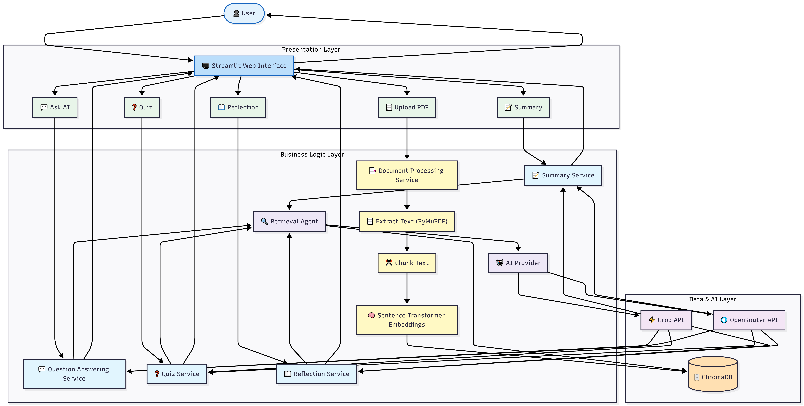
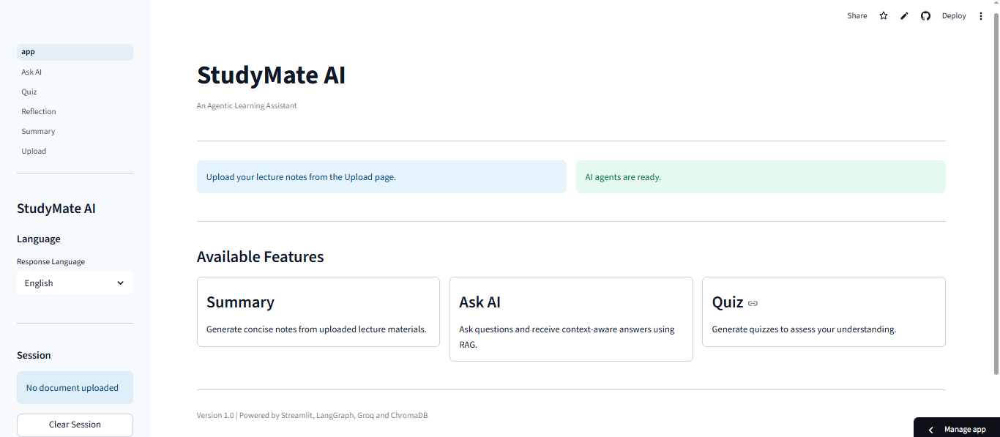
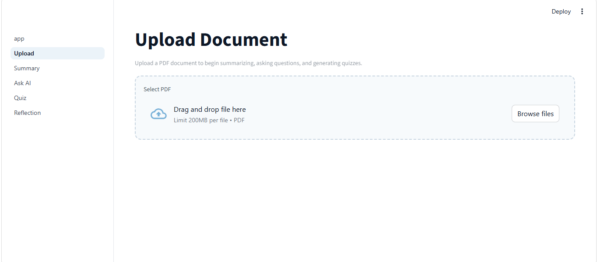
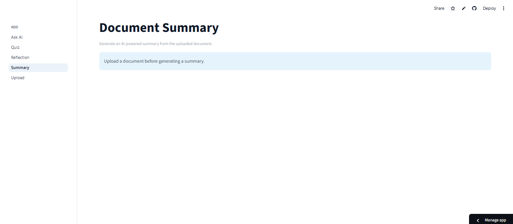
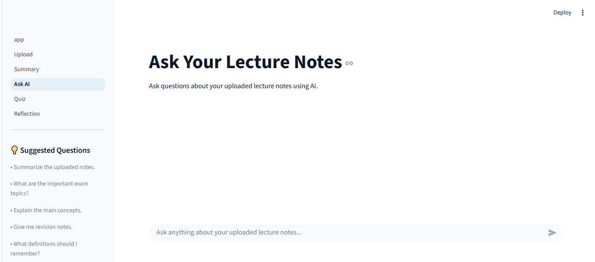
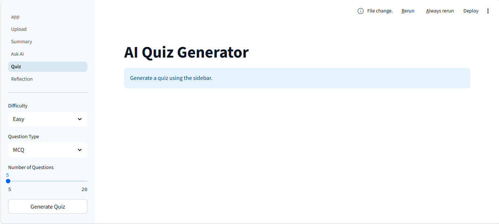
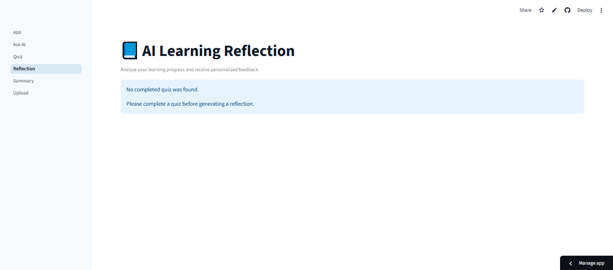

# StudyMate AI

### An Agentic AI Learning Assistant using Retrieval-Augmented Generation (RAG) and Large Language Models


StudyMate AI is an intelligent learning assistant developed using **Streamlit**, **LangChain**, **LangGraph**, and **Large Language Models (LLMs)**. The application enables students to upload lecture notes, generate AI-powered summaries, ask context-aware questions, create quizzes, and receive personalized learning reflections through a Retrieval-Augmented Generation (RAG) pipeline.

---

# Live Demo

**StudyMate AI**

https://studymate-agent.streamlit.app/

---

# GitHub Repository

https://github.com/roshini-nawanjala/StudyMate-AI

---

# Table of Contents

- Features
- Technology Stack
- System Architecture
- RAG Workflow
- Project Structure
- Installation
- Usage
- Environment Variables
- Screenshots
- Known Limitations
- Future Improvements
- Author
- License

---

# Features

- Upload lecture notes in PDF format
- Automatic PDF text extraction
- Intelligent document chunking
- Retrieval-Augmented Generation (RAG)
- AI-generated document summaries
- Context-aware Question Answering
- AI Quiz Generation
- Personalized Learning Reflection
- ChromaDB vector storage
- Sentence Transformer embeddings
- Multi-agent architecture
- Support for Groq and OpenRouter

---

# Technology Stack

## Frontend

- Streamlit

## Backend

- Python

## AI Framework

- LangChain
- LangGraph

## Language Models

- Groq API
- OpenRouter API

## Vector Database

- ChromaDB

## Embedding Model

- Sentence Transformers

## Supporting Libraries

- PyMuPDF
- PyPDF
- python-dotenv
- tiktoken

---

# System Architecture

The following architecture illustrates the overall workflow of StudyMate AI, including the Presentation Layer, Business Logic Layer, Retrieval-Augmented Generation pipeline, AI providers, and ChromaDB vector database.



---

# How StudyMate AI Works

The application follows a Retrieval-Augmented Generation (RAG) workflow.

1. User uploads a lecture note.
2. PDF text is extracted using PyMuPDF.
3. Text is divided into chunks.
4. Sentence Transformer generates embeddings.
5. Embeddings are stored in ChromaDB.
6. User selects a learning feature.
7. Retrieval Agent performs similarity search.
8. Relevant document chunks are retrieved.
9. Context is sent to Groq or OpenRouter.
10. AI generates the final response.

---

# Project Structure

```text
StudyMate-AI/
│
├── agents/
├── assets/
├── components/
├── data/
├── models/
├── pages/
├── prompts/
├── rag/
├── services/
├── tests/
├── utils/
│
├── app.py
├── Home.py
├── config.py
├── requirements.txt
└── README.md
```

---

# Installation

Clone the repository

```bash
git clone https://github.com/roshini-nawanjala/StudyMate-AI.git
```

Move into the project

```bash
cd StudyMate-AI
```

Create virtual environment

```bash
python -m venv venv
```

Activate environment

Windows

```bash
venv\Scripts\activate
```

Linux / macOS

```bash
source venv/bin/activate
```

Install packages

```bash
pip install -r requirements.txt
```

Run the application

```bash
streamlit run Home.py
```

---

# Usage

1. Launch the application.
2. Upload a PDF lecture note.
3. Wait until indexing is completed.
4. Select one of the AI learning tools.
5. Receive AI-generated results.

---

# Environment Variables

Create a `.env` file.

```env
GROQ_API_KEY=your_groq_api_key

OPENROUTER_API_KEY=your_openrouter_api_key
```

---

# Application Screenshots

## Home Page

The main dashboard provides quick access to all AI learning tools.



---

## Upload Page

Upload lecture notes for AI-powered processing.



---

## Document Summary

Generate concise AI-powered summaries.



---

## Ask AI

Ask questions about uploaded lecture notes using Retrieval-Augmented Generation.



---

## AI Quiz Generator

Automatically generate quizzes from uploaded documents.



---

## AI Learning Reflection

Receive personalized study feedback and recommendations.



---

# Known Limitations

- PDF documents only
- Internet connection required
- API keys required
- OCR is not supported
- Large PDFs require more processing time
- Single document session

---

# Future Improvements

- Multi-document support
- OCR integration
- Chat history
- Authentication
- Cloud storage
- Learning analytics
- Export summaries
- Mobile responsiveness

---

# Author

**Roshini Nawanjala**

Faculty of Information Technology

Horizon Campus

GitHub

https://github.com/roshini-nawanjala

---

# License

This project was developed for academic and educational purposes.

---

## ⭐ If you found this project useful, don't forget to give it a star!