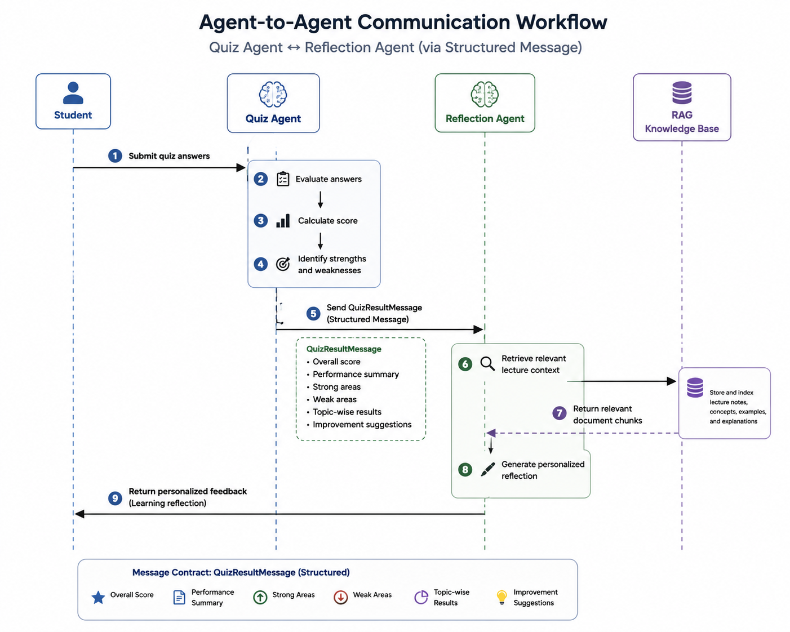

# StudyMate AI

### An Agentic AI Learning Assistant using Retrieval-Augmented Generation (RAG), Multi-Agent Collaboration, and Task-Based Large Language Model Selection


---

## Project Overview

StudyMate AI is an Agentic AI learning assistant for working with lecture notes. Students upload PDF material, then use specialized learning features to summarize content, ask grounded questions, generate and evaluate quizzes, and receive personalized reflections.

The application combines:

- Retrieval-Augmented Generation (RAG) for document-grounded responses.
- Semantic retrieval with Sentence Transformers and ChromaDB.
- Specialized agents coordinated through a modular application architecture.
- Explicit Quiz Agent to Reflection Agent communication through a structured `QuizResultMessage`.
- Deliberate task-based model selection between Groq and OpenRouter.

The system is designed for an end-to-end learning workflow: upload, index, retrieve, generate, evaluate, and reflect.

## Table of Contents

- [Project Overview](#project-overview)
- [Key Features](#key-features)
- [Technology Stack](#technology-stack)
- [Large Language Model Selection Strategy](#large-language-model-selection-strategy)
- [Agentic AI Architecture](#agentic-ai-architecture)
- [Agentic AI Design Patterns](#agentic-ai-design-patterns)
- [Agent-to-Agent Communication](#agent-to-agent-communication)
- [Retrieval-Augmented Generation (RAG)](#retrieval-augmented-generation-rag)
- [System Architecture](#system-architecture)
- [Project Structure](#project-structure)
- [Installation](#installation)
- [Usage](#usage)
- [Deployment](#deployment)
- [Screenshots](#screenshots)
- [RAG Evaluation](#rag-evaluation)
- [Known Limitations](#known-limitations)
- [Future Improvements](#future-improvements)
- [Author](#author)
- [License](#license)
- [Acknowledgements](#acknowledgements)
- [Conclusion](#conclusion)

---

## Key Features

### Document Processing

- PDF lecture-note upload.
- Text extraction using PyMuPDF.
- Intelligent document chunking.
- Sentence Transformer embedding generation.
- Persistent vector storage in ChromaDB.

### Learning Features

- AI-generated document summaries.
- Context-aware question answering.
- Quiz generation from uploaded material.
- Automatic quiz scoring and evaluation.
- Detailed quiz review and performance feedback.
- Personalized learning reflection.

### Agentic Capabilities

- Specialized agents for processing, retrieval, generation, evaluation, and reflection.
- Structured Quiz Agent to Reflection Agent communication.
- Versioned `QuizResultMessage` protocol.
- Task-based LLM routing through `AIProvider`.
- Streamlit session-state persistence for multi-page workflows.

### User Experience

- Streamlit interface with separate learning pages.
- Automatic provider selection when `provider="auto"` is used.
- A workflow that follows upload, summary, questioning, quiz, and reflection stages.
- Modular services that preserve separation between UI, retrieval, and AI logic.

---

## Technology Stack

| Category | Technology | Purpose |
|----------|------------|---------|
| Programming Language | Python 3.12 | Core application development |
| Frontend | Streamlit | Interactive web-based user interface |
| AI Framework | LangChain | Prompt orchestration and LLM integration |
| Agent Framework | LangGraph | Multi-agent workflow orchestration |
| Large Language Models | Groq | Fast generation for summaries and quizzes |
| Large Language Models | OpenRouter | Reasoning-intensive question answering and learning reflections |
| Retrieval Architecture | Retrieval-Augmented Generation (RAG) | Ground AI responses using uploaded lecture notes |
| Vector Database | ChromaDB | Persistent semantic vector storage |
| Embedding Model | Sentence Transformers (all-MiniLM-L6-v2) | Semantic document embeddings |
| PDF Processing | PyMuPDF | PDF text extraction |
| PDF Support | PyPDF | Additional PDF handling |
| Environment Management | python-dotenv | Secure API key management |
| Token Management | tiktoken | Token counting and optimization |

---

## Large Language Model Selection Strategy

StudyMate AI uses deliberate task-based model selection instead of routing every task to one model. When `provider="auto"` is selected, `AIProvider` chooses a preferred provider according to the task. Explicit `provider="groq"` and `provider="openrouter"` values continue to override automatic routing.

| Learning Task | Selected Model | Latency | Cost | Context Window | Reasoning Quality | Justification |
|--------------|----------------|---------|------|----------------|-------------------|---------------|
| Document Summary | Groq | Low | Low | Medium | Good | Fast generation of concise summaries with low response time. |
| Quiz Generation | Groq | Low | Low | Medium | Good | Efficient generation of structured multiple-choice questions. |
| Question Answering | OpenRouter | Medium | Medium | Large | High | Better contextual reasoning over retrieved lecture content. |
| Learning Reflection | OpenRouter | Medium | Medium | Large | High | Produces detailed personalized reflections and learning recommendations. |

Groq is used for fast, generation-focused tasks such as summaries and quizzes, where low latency and efficient structured output are important. OpenRouter is used for question answering and reflection, where contextual interpretation and reasoning-intensive responses are more important than minimum latency.

The task mapping is:

- Summary → Groq
- Quiz → Groq
- Question answering → OpenRouter
- Reflection → OpenRouter

If the preferred provider is unavailable, the existing provider fallback behavior is retained.

---

## Agentic AI Architecture

StudyMate AI uses specialized agents rather than assigning every responsibility to one model. Each agent owns a focused part of the learning workflow and uses shared retrieval and provider services when required.

| Agent | Responsibility |
|--------|----------------|
| Document Processing Agent | Extracts PDF text, chunks documents, generates embeddings, and stores vectors in ChromaDB. |
| Retrieval Agent | Performs semantic similarity search and returns relevant document chunks. |
| Summary Agent | Generates concise summaries from retrieved lecture context. |
| Question Answering Agent | Produces context-aware answers grounded in retrieved content. |
| Quiz Agent | Generates quizzes, evaluates answers, calculates scores, and publishes structured quiz results. |
| Reflection Agent | Uses quiz results and lecture context to create personalized learning feedback. |
| AIProvider Routing Agent | Performs task-based model selection and invokes Groq or OpenRouter. |

This division provides clear responsibilities, easier maintenance, and a practical demonstration of Agentic AI collaboration.

---

## Agentic AI Design Patterns

### 1. Routing Pattern

`AIProvider` selects a preferred model based on the learning task. Generation-focused work is routed to Groq, while question answering and reflection are routed to OpenRouter.

### 2. Reflection Pattern

The Reflection Agent analyzes quiz performance, identifies strengths and weak areas, and produces recommendations for further study instead of returning only a numeric score.

### 3. Tool Use Pattern

Agents use external capabilities before generation, including PDF processing, semantic retrieval, ChromaDB vector search, and Sentence Transformer embeddings. Retrieved knowledge is supplied to the selected LLM as grounding context.

---

## Agent-to-Agent Communication

StudyMate AI implements explicit communication between the **Quiz Agent** and the **Reflection Agent** through a structured `QuizResultMessage` dataclass. The message is the communication protocol; `st.session_state` is only the persistence and transport layer used to make the message available across Streamlit pages.

### Communication Workflow

1. The Quiz Agent evaluates the completed quiz.
2. It creates a versioned `QuizResultMessage` object.
3. The object is stored in `st.session_state` so it survives navigation between pages.
4. The Reflection Agent receives the object from session state.
5. The Reflection Agent consumes the object directly rather than rebuilding quiz statistics from separate variables.
6. Retrieved lecture context is combined with the structured message to generate the reflection.



### QuizResultMessage Structure

```json
{
  "message_type": "quiz_result",
  "version": 1,
  "score": 85.0,
  "correct_answers": 17,
  "wrong_answers": 3,
  "total_questions": 20,
  "status": "PASS",
  "weak_topics": [
    "Embeddings",
    "Vector Databases"
  ],
  "strong_topics": [
    "Retrieval-Augmented Generation"
  ],
  "recommendation": "Review embedding concepts before attempting another quiz."
}
```

This is agent-to-agent communication because one agent publishes a machine-readable contract and another agent consumes that contract as its input. The Reflection Agent does not recalculate the score or reconstruct the quiz analysis from independent session-state fields.

---

## Retrieval-Augmented Generation (RAG)

RAG grounds generated responses in the student's uploaded lecture notes. Instead of relying only on an LLM's internal knowledge, the application retrieves relevant document chunks before generation. This reduces hallucinations and improves contextual consistency across summaries, questions, quizzes, reviews, and reflections.

### RAG Workflow

```text
              Upload PDF
                   │
                   ▼
        Extract Text (PyMuPDF)
                   │
                   ▼
        Intelligent Document Chunking
                   │
                   ▼
 Generate Embeddings (Sentence Transformers)
                   │
                   ▼
      Store Embeddings in ChromaDB
                   │
                   ▼
        User Requests a Learning Task
                   │
                   ▼
     Semantic Similarity Search (Retriever)
                   │
                   ▼
 Retrieve Most Relevant Document Chunks
                   │
                   ▼
      AIProvider Task-Based Model Selection
                   │
                   ▼
      Generate Context-Aware AI Response
```

### Semantic Retrieval Process

1. The user's request is converted into a semantic embedding.
2. ChromaDB searches for similar document chunks.
3. The highest-ranked chunks are retrieved.
4. Retrieved context is combined with the task prompt.
5. The selected LLM generates the response from the request and retrieved context.

Semantic retrieval finds conceptually related content even when exact query terms are absent.

### RAG Components

| Component | Responsibility |
|-----------|----------------|
| PyMuPDF | Extracts text from uploaded PDF documents. |
| Document Chunker | Splits extracted text into semantic chunks. |
| Sentence Transformers | Converts text into vector embeddings. |
| ChromaDB | Stores document embeddings for semantic retrieval. |
| Retrieval Agent | Finds the most relevant document chunks. |
| AIProvider | Selects the provider for the requested task. |
| Large Language Model | Generates the final context-aware response. |

The RAG pipeline is shared across the learning features, allowing each specialized agent to use the same indexed lecture knowledge without retraining the language model.

---

## System Architecture

StudyMate AI follows a layered architecture that connects the Streamlit interface, application services, retrieval pipeline, and AI providers.

| Layer | Responsibility |
|--------|----------------|
| Presentation Layer | Provides the Streamlit interface for uploading documents and using learning features. |
| Application Layer | Coordinates processing, retrieval, summaries, questions, quizzes, and reflections. |
| Retrieval Layer | Uses Sentence Transformers and ChromaDB to retrieve relevant chunks. |
| AI Layer | Performs task-based model selection and generates responses using Groq or OpenRouter. |


### End-to-End System Workflow

```text
                    Student
                       │
                       ▼
             Upload Lecture Notes
                       │
                       ▼
          PDF Processing (PyMuPDF)
                       │
                       ▼
        Intelligent Document Chunking
                       │
                       ▼
     Generate Semantic Embeddings
       (Sentence Transformers)
                       │
                       ▼
        Store Vectors in ChromaDB
                       │
                       ▼
         Select Learning Feature
                       │
     ┌────────┬──────────┬──────────┬────────────┐
     ▼        ▼          ▼          ▼
 Summary   Ask AI      Quiz    Reflection
     │        │          │          │
     └────────┴──────────┴──────────┴────────────┘
                       │
                       ▼
          Retrieval Agent
                       │
                       ▼
      Semantic Similarity Search
                       │
                       ▼
    Retrieve Relevant Document Chunks
                       │
                       ▼
        AIProvider Routing Agent
             ┌─────────┴─────────┐
             ▼                   ▼
           Groq              OpenRouter
             └─────────┬─────────┘
                       ▼
          Context-Aware AI Response
                       │
                       ▼
              Display Results
```

### Learning Workflow

1. Upload a PDF lecture note.
2. Extract and preprocess the content.
3. Generate semantic embeddings and store them in ChromaDB.
4. Select a learning feature.
5. Retrieve relevant document context.
6. Apply task-based model selection.
7. Generate and display a grounded response.
8. After a quiz, send `QuizResultMessage` to the Reflection Agent for personalized feedback.

---

## Project Structure

```text
StudyMate-AI/
│
├── agents/
│   ├── ai_provider.py          # Task-based model selection
│   ├── messages.py             # QuizResultMessage communication contract
│   └── ...
│
├── assets/
│   └── screenshots/            # README images and architecture diagrams
│
├── components/                 # Reusable Streamlit UI components
├── data/
│   ├── chroma_db/              # ChromaDB vector database
│   └── uploads/                # Uploaded lecture notes
├── models/                     # Embedding model configuration
├── pages/                      # Streamlit application pages
├── prompts/                    # Prompt templates for AI agents
├── rag/                        # Retrieval-Augmented Generation pipeline
├── services/
│   ├── summary_service.py
│   ├── chat_service.py
│   ├── quiz_service.py
│   ├── reflection_service.py
│   └── ...
├── tests/                      # Project testing modules
├── utils/                      # Helper functions
├── app.py                      # Main Streamlit application
├── Home.py                     # Landing page
├── config.py                   # Project configuration
├── requirements.txt            # Python dependencies
├── .env.example                # Environment variables template
└── README.md
```

| Directory | Responsibility |
|-----------|----------------|
| **agents/** | AI agents, task-based routing, and structured communication. |
| **assets/** | Screenshots, architecture diagrams, and documentation resources. |
| **components/** | Reusable Streamlit interface components. |
| **data/** | Uploaded documents and ChromaDB vector embeddings. |
| **models/** | Embedding model configuration and resources. |
| **pages/** | Individual Streamlit application pages. |
| **prompts/** | Prompt templates used by AI agents. |
| **rag/** | Retrieval, context preparation, and RAG utilities. |
| **services/** | Summarization, question answering, quiz, and reflection logic. |
| **tests/** | Testing modules. |
| **utils/** | Shared helper functions. |

---

## Installation

### Prerequisites

- Python 3.12 or later
- Git
- Internet connection
- Groq API key
- OpenRouter API key

## 1. Clone the Repository

```bash
git clone https://github.com/roshini-nawanjala/StudyMate-AI.git
```

## 2. Navigate to the Project Directory

```bash
cd StudyMate-AI
```

## 3. Create a Virtual Environment

### Windows

```bash
python -m venv venv
```

### Linux / macOS

```bash
python3 -m venv venv
```

## 4. Activate the Virtual Environment

### Windows

```bash
venv\Scripts\activate
```

### Linux / macOS

```bash
source venv/bin/activate
```

## 5. Install Project Dependencies

```bash
pip install --upgrade pip

pip install -r requirements.txt
```

## 6. Configure Environment Variables

Create a `.env` file in the project root directory and add the following API keys.

```env
GROQ_API_KEY=your_groq_api_key

OPENROUTER_API_KEY=your_openrouter_api_key

GROQ_MODEL=your_groq_model

OPENROUTER_MODEL=your_openrouter_model
```

## 7. Run the Application

```bash
streamlit run app.py
```

After the application starts successfully, open your browser and navigate to:

```text
http://localhost:8501
```

---

## Usage

1. Open the **Upload** page and upload a lecture note in PDF format.
2. Wait for text extraction, chunking, embedding generation, and ChromaDB indexing to finish.
3. Open **Summary** to generate a concise document summary.
4. Open **Ask AI** to ask questions grounded in the uploaded notes.
5. Open **Quiz** to generate questions, submit answers, and review the evaluation.
6. Open **Reflection** to generate personalized feedback from the latest quiz result.

The Summary and Quiz tasks use Groq through task-based routing. Question answering and reflection use OpenRouter. The Reflection Agent receives the structured `QuizResultMessage` produced by the Quiz Agent.

### Complete Learning Workflow

```text
Upload PDF
      │
      ▼
Extract Text
      │
      ▼
Generate Embeddings
      │
      ▼
Store in ChromaDB
      │
      ▼
Choose Learning Feature
      │
      ▼
Retrieve Relevant Context
      │
      ▼
Task-Based Model Selection
      │
      ▼
Generate AI Response
      │
      ▼
QuizResultMessage
      │
      ▼
Personalized Reflection
```

---

## Deployment

StudyMate AI is deployed using **Streamlit Community Cloud**.

**Live Application**

https://studymate-agent.streamlit.app/

**Source Code**

https://github.com/roshini-nawanjala/StudyMate-AI

---

## Screenshots

The following screenshots cover the main learning workflow.

### Home Page


### Upload Lecture Notes


### AI Document Summary


### Context-Aware Question Answering


### AI Quiz Generation


### Personalized Learning Reflection


### System Architecture


---

## RAG Evaluation

The RAG pipeline was evaluated with representative learning queries. Each query used semantic similarity search in ChromaDB before the selected LLM generated a response.

### Evaluation Criteria

- Relevance of retrieved document chunks.
- Grounding in uploaded lecture content.
- Accuracy of generated responses.
- Consistency across learning tasks.

### Retrieval Evaluation Results

| Query | Retrieved Context | Response Quality | Observation |
|--------|-------------------|------------------|-------------|
| Summarize the uploaded lecture notes | Relevant lecture sections | High | Retrieved context matched the uploaded lecture content and supported accurate summarization. |
| Explain Retrieval-Augmented Generation | Relevant RAG concepts | High | Relevant document chunks were retrieved before generating the explanation. |
| Generate a quiz from the lecture | Relevant educational content | High | Retrieved context provided sufficient information for generating meaningful quiz questions. |
| What are Vector Embeddings? | Relevant embedding concepts | High | Retrieved content was directly related to the query, resulting in a context-aware explanation. |
| Generate a learning reflection | QuizResultMessage and retrieved lecture context | High | The Reflection Agent combined structured quiz results with lecture content to generate personalized feedback. |

### Evaluation Summary

The evaluation indicates that semantic retrieval consistently returned relevant chunks, improved grounding, and kept generated summaries, quizzes, questions, and reflections aligned with the uploaded lecture notes.

---

## Known Limitations

- PDF documents are currently the only supported input format.
- Scanned PDFs requiring OCR are not supported.
- Only one lecture document can be processed at a time.
- Internet access and valid Groq/OpenRouter API keys are required for AI features.
- Response quality depends on the completeness and quality of uploaded notes.
- Very large PDFs may require additional extraction, embedding, and indexing time.
- Long-term conversation history is not maintained between user sessions.
- User authentication and personalized learning profiles are not implemented.
- Retrieval performance depends on document chunking and embedding quality.

The current implementation nevertheless demonstrates an end-to-end Agentic AI learning assistant with semantic retrieval, structured communication, and deliberate model selection.

---

## Future Improvements

- Support multiple PDFs in one knowledge base.
- Add document categorization, deletion, and updates.
- Combine semantic and keyword retrieval.
- Add document reranking and source citations.
- Generate adaptive quizzes from previous performance.
- Recommend personalized study plans.
- Generate flashcards and AI-assisted revision sessions.
- Add authentication and personalized learning profiles.
- Maintain conversation history across sessions.
- Provide downloadable summaries, quizzes, and reports.
- Improve mobile and tablet support.
- Add OCR for scanned PDFs.
- Integrate additional LLM providers.
- Expand the agent architecture with planning and recommendation agents.
- Improve routing through performance-based model selection.
- Add learning progress dashboards.
- Track quiz performance over time.
- Visualize strengths and weak topics.
- Generate recommendations from historical performance.
- Evolve StudyMate AI into a personalized platform for intelligent tutoring, adaptive assessment, and continuous progress monitoring.

---

## Author

**Roshini Nawanjala**
Undergraduate – Faculty of Information Technology  
Horizon Campus  
Sri Lanka

### GitHub

https://github.com/roshini-nawanjala

### Project Repository

https://github.com/roshini-nawanjala/StudyMate-AI

### Live Demo

https://studymate-agent.streamlit.app/

---

## License

This project was developed for academic and educational purposes as part of a university assignment. The source code is intended for learning, research, and demonstration purposes only.

---

## Acknowledgements

StudyMate AI uses the following open-source technologies and services:

- Streamlit
- LangChain
- LangGraph
- ChromaDB
- Sentence Transformers
- PyMuPDF
- PyPDF
- Groq
- OpenRouter
- python-dotenv
- tiktoken

The author gratefully acknowledges the developers and maintainers of these projects.

---

## Conclusion

StudyMate AI demonstrates how Agentic AI, RAG, semantic retrieval, structured agent communication, and deliberate model selection can support grounded summaries, question answering, quiz evaluation, and personalized reflection in an educational application.
