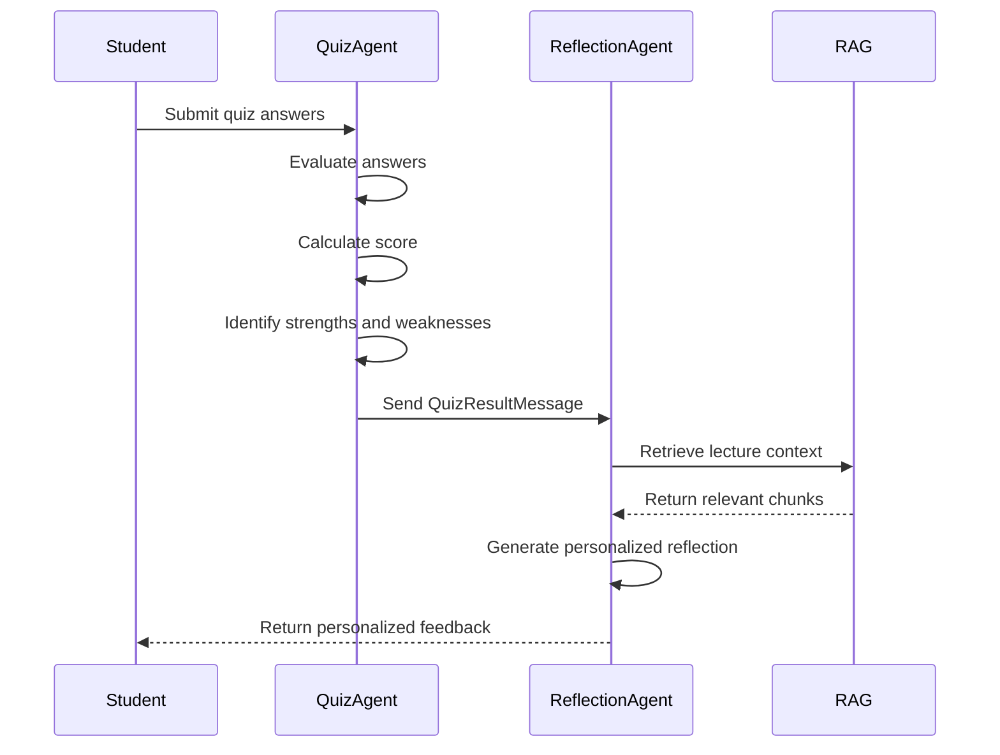

# StudyMate AI

### An Agentic AI Learning Assistant using Retrieval-Augmented Generation (RAG), Multi-Agent Collaboration, and Task-Based Large Language Model Selection


---

## Project Overview

StudyMate AI is an intelligent Agentic AI learning assistant developed to enhance students' learning experiences through Retrieval-Augmented Generation (RAG), multi-agent collaboration, and Large Language Models (LLMs). The system enables students to upload lecture notes in PDF format and interact with the content through AI-powered learning tools, including document summarization, context-aware question answering, quiz generation, quiz review, and personalized learning reflection.

Unlike conventional AI assistants that rely on a single language model for every task, StudyMate AI adopts a deliberate task-based model selection strategy. The application automatically routes generation-focused tasks to Groq for low-latency responses, while reasoning-intensive tasks are processed through OpenRouter to improve contextual understanding and analytical quality.

The application also demonstrates explicit agent-to-agent communication. The Quiz Agent produces a structured `QuizResultMessage` object that is consumed directly by the Reflection Agent without recalculating quiz statistics. This structured communication enables agents to exchange machine-readable information while maintaining clear separation of responsibilities.

To improve response accuracy and reduce hallucinations, StudyMate AI integrates a Retrieval-Augmented Generation (RAG) pipeline. Uploaded lecture notes are converted into semantic embeddings using Sentence Transformers and stored in ChromaDB. Relevant document chunks are retrieved through semantic similarity search before generating responses, ensuring that answers remain grounded in the uploaded learning material.

The system is implemented using Streamlit, LangChain, LangGraph, ChromaDB, Groq, OpenRouter, and Sentence Transformers. Together, these technologies provide a scalable, modular, and context-aware learning environment that demonstrates practical applications of Agentic AI in modern educational systems.

---

# Key Features

StudyMate AI provides a complete AI-assisted learning workflow by integrating Retrieval-Augmented Generation (RAG), multi-agent collaboration, semantic retrieval, and task-based Large Language Model (LLM) selection.

### Document Processing

- Upload lecture notes in PDF format.
- Automatic text extraction using PyMuPDF.
- Intelligent document chunking for semantic retrieval.
- Automatic vector embedding generation using Sentence Transformers.
- Persistent vector storage using ChromaDB.

### Retrieval-Augmented Generation (RAG)

- Semantic similarity search over uploaded lecture notes.
- Context-aware retrieval before every AI response.
- Reduced hallucinations by grounding responses in retrieved document chunks.
- Retrieval pipeline integrated with all learning features.

### AI-Powered Learning Features

- AI-generated document summaries.
- Context-aware question answering based on uploaded lecture notes.
- Automatic quiz generation.
- AI-assisted quiz evaluation and scoring.
- AI-generated quiz review with detailed explanations.
- Personalized learning reflections based on quiz performance.

### Agentic AI Capabilities

- Multi-agent architecture implemented using LangGraph.
- Structured communication between the Quiz Agent and Reflection Agent.
- Machine-readable `QuizResultMessage` contract for inter-agent communication.
- Automatic task-based routing between multiple Large Language Models.
- Deliberate model selection strategy for different learning tasks.

### User Experience

- Simple and intuitive Streamlit interface.
- Automatic AI provider selection without user configuration.
- Fast document indexing and semantic search.
- Interactive learning workflow from document upload to personalized reflection.
- Modular architecture designed for future scalability.

---

# Technology Stack

StudyMate AI is developed using a modern AI technology stack that combines Retrieval-Augmented Generation (RAG), Large Language Models, semantic search, and multi-agent orchestration.

| Category | Technology | Purpose |
|----------|------------|---------|
| Programming Language | Python 3.12 | Core application development |
| Frontend | Streamlit | Interactive web-based user interface |
| AI Framework | LangChain | Prompt orchestration and LLM integration |
| Agent Framework | LangGraph | Multi-agent workflow orchestration |
| Large Language Models | Groq | Fast generation for summaries and quizzes |
| Large Language Models | OpenRouter | Reasoning-intensive question answering and learning reflections |
| Retrieval Architecture | Retrieval-Augmented Generation (RAG) | Ground AI responses using uploaded lecture notes |
| Vector Database | ChromaDB | Persistent semantic vector storage |
| Embedding Model | Sentence Transformers (all-MiniLM-L6-v2) | Semantic document embeddings |
| PDF Processing | PyMuPDF | PDF text extraction |
| PDF Support | PyPDF | Additional PDF handling |
| Environment Management | python-dotenv | Secure API key management |
| Token Management | tiktoken | Token counting and optimization |

---

## Large Language Model Selection Strategy

Rather than relying on a single language model for every task, StudyMate AI applies a deliberate task-based model selection strategy.

Generation-focused tasks are routed to **Groq**, which provides low-latency responses and efficient structured output. Reasoning-intensive tasks are routed to **OpenRouter**, enabling stronger contextual reasoning and analytical responses.

| Learning Task | Selected Model | Reason |
|--------------|----------------|--------|
| Document Summary | Groq | Fast generation of concise summaries |
| Quiz Generation | Groq | Efficient structured content generation |
| Question Answering | OpenRouter | Better contextual reasoning over retrieved knowledge |
| Learning Reflection | OpenRouter | Stronger analytical reasoning and personalized feedback |

This routing is implemented internally by the **AIProvider** component. When `provider="auto"` is selected, the application automatically chooses the most appropriate language model based on the requested task. Explicit provider selection (`groq` or `openrouter`) always overrides automatic routing, preserving backward compatibility while demonstrating deliberate model selection.

---

# Agentic AI Architecture

StudyMate AI is designed as an Agentic AI system in which multiple specialized agents collaborate to complete different learning tasks. Instead of assigning every responsibility to a single Large Language Model, the application delegates specific tasks to independent agents, each responsible for a well-defined stage of the learning workflow.

Each agent operates independently while collaborating through structured communication and shared retrieval mechanisms. This modular design improves maintainability, scalability, and separation of responsibilities while demonstrating practical Agentic AI principles.

The system consists of the following specialized agents:

| Agent | Responsibility |
|--------|----------------|
| Document Processing Agent | Extracts text from uploaded PDF documents, performs document chunking, generates embeddings, and stores vectors in ChromaDB. |
| Retrieval Agent | Performs semantic similarity search and retrieves the most relevant document chunks for the requested learning task. |
| Summary Agent | Generates concise summaries using the retrieved document context. |
| Question Answering Agent | Produces context-aware answers grounded in retrieved lecture content. |
| Quiz Agent | Generates quizzes, evaluates student answers, calculates scores, and produces structured quiz results. |
| Reflection Agent | Generates personalized learning reflections using structured quiz results and retrieved lecture context. |
| AIProvider Routing Agent | Automatically performs task-based model selection, routing requests to the most appropriate Large Language Model. |

---

# Agentic AI Design Patterns

StudyMate AI demonstrates multiple Agentic AI design patterns commonly used in modern AI applications.

## 1. Routing Pattern

The AIProvider component implements a routing pattern by automatically selecting the most suitable Large Language Model for each task.

- Summary → Groq
- Quiz → Groq
- Question Answering → OpenRouter
- Reflection → OpenRouter

This strategy improves efficiency by assigning generation-focused tasks to a low-latency model while allocating reasoning-intensive tasks to a model better suited for contextual analysis.

---

## 2. Reflection Pattern

The Reflection Agent analyzes the student's quiz performance and generates personalized feedback.

Rather than simply reporting a quiz score, the Reflection Agent identifies learning strengths, weak topics, and recommended areas for improvement, encouraging continuous learning through AI-assisted self-reflection.

---

## 3. Tool Use Pattern

The learning agents do not rely solely on Large Language Models.

Before generating responses, they use external tools including:

- PDF processing
- Semantic document retrieval
- ChromaDB vector search
- Sentence Transformer embeddings

The retrieved knowledge is then supplied to the language model, ensuring responses remain grounded in uploaded lecture material.

---

## Benefits of the Agentic Architecture

The adopted Agentic AI architecture provides several practical advantages:

- Clear separation of responsibilities between agents.
- Independent execution of specialized learning tasks.
- Improved scalability through modular agent design.
- Easier maintenance and future feature expansion.
- Reduced hallucinations through Retrieval-Augmented Generation.
- Efficient use of multiple Large Language Models through deliberate task-based routing.
- Improved learning experience through personalized AI-generated feedback.

---

# Agent-to-Agent Communication

StudyMate AI implements explicit agent-to-agent communication through a structured message contract rather than exchanging unstructured text or reconstructing information from independent variables.

The communication occurs between the **Quiz Agent** and the **Reflection Agent**.

After a student submits a quiz, the Quiz Agent evaluates the answers, calculates the overall performance, identifies strong and weak learning areas, and packages the results into a structured `QuizResultMessage` object.

Instead of recalculating quiz statistics, the Reflection Agent consumes this message directly to generate personalized learning feedback. This approach establishes a clear communication protocol between independent agents while preserving separation of responsibilities.

The communication workflow is illustrated below.



## QuizResultMessage Structure

The Quiz Agent publishes a structured message that represents the student's quiz performance.

```json
{
  "message_type": "quiz_result",
  "version": 1,
  "score": 85.0,
  "correct_answers": 17,
  "wrong_answers": 3,
  "total_questions": 20,
  "status": "PASS",
  "weak_topics": [
    "Embeddings",
    "Vector Databases"
  ],
  "strong_topics": [
    "Retrieval-Augmented Generation"
  ],
  "recommendation": "Review embedding concepts before attempting another quiz."
}
```

## Communication Protocol

The communication process follows these steps:

1. The Quiz Agent evaluates the completed quiz.
2. A structured `QuizResultMessage` object is created.
3. The message is temporarily persisted using `st.session_state`.
4. The Reflection Agent receives the structured message.
5. The Reflection Agent retrieves supporting lecture context using the RAG pipeline.
6. A personalized learning reflection is generated from both the structured quiz message and the retrieved document context.

> **Note:** `st.session_state` acts only as a temporary persistence and transport mechanism between Streamlit pages. It is **not** the communication protocol. The communication protocol is the structured `QuizResultMessage` object exchanged between the Quiz Agent and the Reflection Agent.

## Benefits

This communication mechanism provides several advantages:

- Explicit machine-readable communication between independent agents.
- Clear separation of responsibilities.
- Eliminates unnecessary recalculation of quiz statistics.
- Improves maintainability through a versioned message contract.
- Supports future extension by allowing additional fields to be added without changing the communication workflow.
- Demonstrates a practical implementation of agent collaboration within an Agentic AI system.

---

# Retrieval-Augmented Generation (RAG)

StudyMate AI implements a Retrieval-Augmented Generation (RAG) architecture to improve the accuracy, reliability, and contextual relevance of AI-generated responses.

Instead of relying solely on the knowledge stored within a Large Language Model, the system retrieves relevant information from the uploaded lecture notes before generating a response. This approach grounds every response in the student's own learning material, reducing hallucinations and improving factual consistency.

The RAG pipeline is shared across all learning features, including document summarization, question answering, quiz generation, quiz review, and personalized learning reflection.

---

## RAG Workflow

The complete Retrieval-Augmented Generation workflow is illustrated below.

```text
              Upload PDF
                   │
                   ▼
        Extract Text (PyMuPDF)
                   │
                   ▼
        Intelligent Document Chunking
                   │
                   ▼
 Generate Embeddings (Sentence Transformers)
                   │
                   ▼
      Store Embeddings in ChromaDB
                   │
                   ▼
        User Requests a Learning Task
                   │
                   ▼
     Semantic Similarity Search (Retriever)
                   │
                   ▼
 Retrieve Most Relevant Document Chunks
                   │
                   ▼
      AIProvider Task-Based Model Selection
                   │
                   ▼
      Generate Context-Aware AI Response
```

---

## Semantic Retrieval Process

When a learning request is submitted, the Retrieval Agent performs semantic similarity search over the indexed lecture content.

The retrieval process consists of the following steps:

1. The user's request is converted into a semantic embedding.
2. ChromaDB searches for the most similar document chunks.
3. The highest-ranked chunks are retrieved.
4. Retrieved context is combined with the user's request.
5. The selected Large Language Model generates a response using both the retrieved context and the prompt.

This retrieval-first approach ensures that AI responses remain grounded in the uploaded lecture material rather than relying entirely on the language model's internal knowledge.

---

## Components of the RAG Pipeline

| Component | Responsibility |
|-----------|----------------|
| PyMuPDF | Extracts text from uploaded PDF documents |
| Document Chunker | Splits extracted text into semantic chunks |
| Sentence Transformers | Converts text into vector embeddings |
| ChromaDB | Stores document embeddings for semantic retrieval |
| Retrieval Agent | Finds the most relevant document chunks |
| AIProvider | Selects the appropriate language model for the requested task |
| Large Language Model | Generates the final context-aware response |

---

## Benefits of the RAG Architecture

The Retrieval-Augmented Generation architecture provides several advantages:

- Reduces AI hallucinations by grounding responses in uploaded lecture notes.
- Produces context-aware answers instead of generic responses.
- Improves factual consistency across learning tasks.
- Enables semantic search rather than keyword matching.
- Supports document-based learning without retraining the language model.
- Allows the same knowledge base to be reused across multiple AI agents.
- Improves the quality of summaries, quizzes, reflections, and question answering.

---

## Integration with Agentic AI

The Retrieval-Augmented Generation pipeline is integrated into the overall Agentic AI architecture.

Before any learning agent generates a response, it first requests relevant document context from the Retrieval Agent. The retrieved context is then passed to the AIProvider, which performs task-based model selection before invoking the appropriate Large Language Model.

This integration enables every agent to generate responses that are both context-aware and grounded in the uploaded learning material while maintaining a modular and scalable architecture.

---

# System Architecture

StudyMate AI follows a layered Agentic AI architecture that integrates document processing, semantic retrieval, multi-agent collaboration, and task-based Large Language Model selection. Each layer is responsible for a specific stage of the learning workflow, promoting modularity, maintainability, and scalability.

The architecture consists of four primary layers:

| Layer | Responsibility |
|--------|----------------|
| Presentation Layer | Provides the Streamlit user interface for uploading documents and interacting with AI-powered learning features. |
| Application Layer | Coordinates document processing, retrieval, quiz generation, question answering, summaries, and personalized reflections through specialized agents. |
| Retrieval Layer | Performs semantic similarity search using Sentence Transformers and ChromaDB to retrieve relevant document chunks. |
| AI Layer | Executes task-based model selection and generates context-aware responses using Groq or OpenRouter. |

The overall architecture of StudyMate AI is illustrated below.


---

# End-to-End System Workflow

The complete workflow of StudyMate AI is illustrated below.

```text
                    Student
                       │
                       ▼
             Upload Lecture Notes
                       │
                       ▼
          PDF Processing (PyMuPDF)
                       │
                       ▼
        Intelligent Document Chunking
                       │
                       ▼
     Generate Semantic Embeddings
       (Sentence Transformers)
                       │
                       ▼
        Store Vectors in ChromaDB
                       │
                       ▼
         Select Learning Feature
                       │
     ┌────────┬──────────┬──────────┬──────────┐
     ▼        ▼          ▼          ▼
 Summary   Ask AI      Quiz    Reflection
     │        │          │          │
     └────────┴──────────┴──────────┘
                  │
                  ▼
          Retrieval Agent
                  │
                  ▼
      Semantic Similarity Search
                  │
                  ▼
    Retrieve Relevant Document Chunks
                  │
                  ▼
        AIProvider Routing Agent
                  │
      ┌───────────┴────────────┐
      ▼                        ▼
    Groq                  OpenRouter
      │                        │
      └───────────┬────────────┘
                  ▼
     Context-Aware AI Response
                  │
                  ▼
          Display Results
```

---

# Learning Workflow

StudyMate AI guides students through a complete AI-assisted learning cycle.

1. Upload a lecture note in PDF format.
2. Extract and preprocess document content.
3. Generate semantic embeddings.
4. Store embeddings in ChromaDB.
5. Select a learning feature.
6. Retrieve the most relevant document chunks.
7. Perform automatic task-based model selection.
8. Generate a context-aware AI response.
9. Present the generated learning content to the student.
10. If a quiz is completed, the Quiz Agent sends a structured `QuizResultMessage` to the Reflection Agent, enabling personalized learning feedback.

This workflow demonstrates how document retrieval, multi-agent collaboration, and deliberate model selection work together to provide an intelligent and personalized learning experience.

---

# Project Structure

The project follows a modular architecture in which each directory is responsible for a specific aspect of the application. This organization improves code readability, maintainability, and future scalability.

```text
StudyMate-AI/
│
├── agents/
│   ├── ai_provider.py          # Task-based model selection
│   ├── messages.py             # QuizResultMessage communication contract
│   └── ...
│
├── assets/
│   └── screenshots/            # README images and architecture diagrams
│
├── components/                 # Reusable Streamlit UI components
│
├── data/
│   ├── chroma_db/              # ChromaDB vector database
│   └── uploads/                # Uploaded lecture notes
│
├── models/                     # Embedding model configuration
│
├── pages/                      # Streamlit application pages
│
├── prompts/                    # Prompt templates for AI agents
│
├── rag/                        # Retrieval-Augmented Generation pipeline
│
├── services/
│   ├── summary_service.py
│   ├── chat_service.py
│   ├── quiz_service.py
│   ├── reflection_service.py
│   └── ...
│
├── tests/                      # Project testing modules
│
├── utils/                      # Helper functions
│
├── app.py                      # Main Streamlit application
├── Home.py                     # Landing page
├── config.py                   # Project configuration
├── requirements.txt            # Python dependencies
├── .env.example                # Environment variables template
└── README.md
```

---

## Directory Responsibilities

| Directory | Responsibility |
|-----------|----------------|
| **agents/** | Implements AI agents, task-based model routing, and structured agent communication. |
| **assets/** | Stores screenshots, architecture diagrams, and other documentation resources. |
| **components/** | Contains reusable Streamlit interface components. |
| **data/** | Stores uploaded documents and ChromaDB vector embeddings. |
| **models/** | Manages embedding model configuration and related resources. |
| **pages/** | Implements individual Streamlit application pages. |
| **prompts/** | Stores prompt templates used by different AI agents. |
| **rag/** | Implements the Retrieval-Augmented Generation pipeline, including retrieval and context preparation. |
| **services/** | Contains the business logic for summarization, question answering, quizzes, and reflections. |
| **tests/** | Includes testing modules for validating application functionality. |
| **utils/** | Provides shared utility functions used across the project. |

---

## Architectural Principles

The project structure follows several software engineering principles:

- **Separation of Concerns** – Each module has a clearly defined responsibility.
- **Modularity** – AI agents, retrieval logic, services, and UI components are implemented independently.
- **Reusability** – Shared functionality is centralized to minimize code duplication.
- **Scalability** – New AI agents and learning features can be integrated with minimal changes to the existing architecture.
- **Maintainability** – The layered structure simplifies debugging, testing, and future development.

---

# Installation and Setup

Follow the steps below to set up and run StudyMate AI on your local machine.

## Prerequisites

Before installing the application, ensure the following software is available on your system:

- Python 3.12 or later
- Git
- Internet connection
- Groq API Key
- OpenRouter API Key

---

## 1. Clone the Repository

```bash
git clone https://github.com/roshini-nawanjala/StudyMate-AI.git
```

---

## 2. Navigate to the Project Directory

```bash
cd StudyMate-AI
```

---

## 3. Create a Virtual Environment

### Windows

```bash
python -m venv venv
```

### Linux / macOS

```bash
python3 -m venv venv
```

---

## 4. Activate the Virtual Environment

### Windows

```bash
venv\Scripts\activate
```

### Linux / macOS

```bash
source venv/bin/activate
```

---

## 5. Install Project Dependencies

```bash
pip install --upgrade pip

pip install -r requirements.txt
```

---

## 6. Configure Environment Variables

Create a `.env` file in the project root directory and add the following API keys.

```env
GROQ_API_KEY=your_groq_api_key

OPENROUTER_API_KEY=your_openrouter_api_key

GROQ_MODEL=your_groq_model

OPENROUTER_MODEL=your_openrouter_model
```

---

## 7. Run the Application

```bash
streamlit run app.py
```

After the application starts successfully, open your browser and navigate to:

```text
http://localhost:8501
```

---

# Application Usage

StudyMate AI provides an end-to-end AI-assisted learning workflow.

### Step 1 – Upload Lecture Notes

- Open the **Upload** page.
- Upload a lecture note in PDF format.
- Wait until the document has been processed.
- The system automatically extracts the text, creates semantic chunks, generates embeddings, and stores them in ChromaDB.

---

### Step 2 – Generate a Summary

Navigate to the **Summary** page.

The Summary Agent retrieves relevant document context and generates a concise summary using the Groq language model.

---

### Step 3 – Ask Questions

Navigate to the **Ask AI** page.

Ask questions related to the uploaded lecture notes.

The Retrieval Agent performs semantic similarity search, and the AIProvider automatically routes the request to OpenRouter for context-aware question answering.

---

### Step 4 – Generate a Quiz

Navigate to the **Quiz** page.

The Quiz Agent generates multiple-choice questions based on the uploaded lecture content, evaluates student responses, and calculates the quiz score automatically.

---

### Step 5 – Review Quiz Performance

After completing the quiz, review:

- Quiz score
- Correct answers
- Incorrect answers
- AI-generated explanations
- Performance summary

---

### Step 6 – Generate a Learning Reflection

Navigate to the **Reflection** page.

The Reflection Agent receives the structured `QuizResultMessage`, retrieves supporting lecture context using the RAG pipeline, and generates personalized learning feedback highlighting strengths, weaknesses, and recommended study areas.

---

# Complete Learning Workflow

```text
Upload PDF
      │
      ▼
Extract Text
      │
      ▼
Generate Embeddings
      │
      ▼
Store in ChromaDB
      │
      ▼
Choose Learning Feature
      │
      ▼
Retrieve Relevant Context
      │
      ▼
Task-Based Model Selection
      │
      ▼
Generate AI Response
      │
      ▼
QuizResultMessage
      │
      ▼
Personalized Reflection
```

---

## Deployment

StudyMate AI is deployed using **Streamlit Community Cloud**.

**Live Application**

https://studymate-agent.streamlit.app/

**Source Code**

https://github.com/roshini-nawanjala/StudyMate-AI

---

# Application Screenshots

The following screenshots illustrate the major features of StudyMate AI and demonstrate the complete AI-assisted learning workflow.

---

## Home Page

The Home page introduces StudyMate AI and provides users with an overview of the application's capabilities. It serves as the starting point for accessing all AI-powered learning features.


---

## Upload Lecture Notes

Students can upload lecture notes in PDF format. The application automatically extracts text, performs intelligent document chunking, generates semantic embeddings, and stores them in ChromaDB for semantic retrieval.

**Key Functions**
- PDF Upload
- Text Extraction
- Document Chunking
- Embedding Generation
- ChromaDB Indexing


---

## AI Document Summary

The Summary Agent retrieves the most relevant lecture content using the RAG pipeline and generates concise summaries.

The AIProvider automatically routes this task to **Groq**, enabling fast and efficient summary generation.

**Key Functions**
- Context-aware summarization
- RAG-supported generation
- Low-latency response


---

## Context-Aware Question Answering

The Ask AI page enables students to ask questions about uploaded lecture notes.

The Retrieval Agent performs semantic similarity search before the AIProvider routes the request to **OpenRouter**, providing more reasoning-intensive and context-aware answers.

**Key Functions**
- Semantic document retrieval
- Context-aware responses
- Grounded AI answers
- Automatic model selection


---

## AI Quiz Generation

The Quiz Agent automatically generates multiple-choice questions using the uploaded lecture material.

After submission, the application evaluates student responses and calculates the quiz score.

**Key Functions**
- Automatic quiz generation
- AI-based answer evaluation
- Score calculation
- Performance analysis


---

## Personalized Learning Reflection

The Reflection Agent receives the structured `QuizResultMessage` generated by the Quiz Agent and combines it with retrieved lecture context to generate personalized feedback.

This demonstrates explicit agent-to-agent communication within the Agentic AI architecture.

**Key Functions**
- Structured agent communication
- Personalized feedback
- Strength and weakness analysis
- Learning recommendations


---

## System Architecture

The following diagram illustrates the complete architecture of StudyMate AI, including document processing, Retrieval-Augmented Generation (RAG), semantic retrieval, task-based model selection, and multi-agent collaboration.


---

## Screenshot Summary

The screenshots demonstrate the complete end-to-end workflow of StudyMate AI:

1. Upload lecture notes.
2. Process and index documents.
3. Generate AI summaries.
4. Ask context-aware questions.
5. Generate quizzes.
6. Evaluate quiz performance.
7. Exchange structured messages between agents.
8. Produce personalized learning reflections.

---

# RAG Retrieval Evaluation

To evaluate the effectiveness of the Retrieval-Augmented Generation (RAG) pipeline, representative learning queries were executed against uploaded lecture notes. For each query, the Retrieval Agent performed semantic similarity search using ChromaDB to retrieve the most relevant document chunks before passing the retrieved context to the selected Large Language Model.

The evaluation assessed whether the retrieved information was relevant to the user's request and whether the generated responses remained grounded in the uploaded learning material.

## Evaluation Criteria

The RAG pipeline was evaluated using the following criteria:

- Relevance of retrieved document chunks
- Context grounding
- Accuracy of generated responses
- Consistency across different learning tasks

The Retrieval Agent uses semantic similarity search instead of keyword matching, enabling conceptually related content to be retrieved even when the exact query terms are not present in the document.

---

## Retrieval Evaluation Results

| Query | Retrieved Context | Response Quality | Observation |
|--------|-------------------|------------------|-------------|
| Summarize the uploaded lecture notes | Relevant lecture sections | High | Retrieved context matched the uploaded lecture content and supported accurate summarization. |
| Explain Retrieval-Augmented Generation | Relevant RAG concepts | High | Relevant document chunks were retrieved before generating the explanation. |
| Generate a quiz from the lecture | Relevant educational content | High | Retrieved context provided sufficient information for generating meaningful quiz questions. |
| What are Vector Embeddings? | Relevant embedding concepts | High | The retrieved content was directly related to the user's query, resulting in a context-aware explanation. |
| Generate a learning reflection | QuizResultMessage and retrieved lecture context | High | The Reflection Agent combined structured quiz results with retrieved lecture content to generate personalized feedback. |

---

## Evaluation Summary

The evaluation indicates that the Retrieval Agent consistently retrieves contextually relevant document chunks before response generation.

Key observations include:

- Semantic retrieval successfully identified relevant lecture content for different learning tasks.
- Retrieved document chunks improved the contextual grounding of AI-generated responses.
- Responses remained aligned with the uploaded lecture notes rather than relying solely on the language model's internal knowledge.
- Quiz generation and document summarization accurately reflected the uploaded learning material.
- Personalized learning reflections effectively combined structured agent communication with retrieved lecture context.

---

## Benefits of the RAG Pipeline

The implemented Retrieval-Augmented Generation architecture provides several practical benefits:

- Improves response accuracy by grounding AI outputs in uploaded lecture notes.
- Reduces hallucinations through context-aware retrieval.
- Enables semantic retrieval rather than simple keyword matching.
- Supports multiple AI learning features using a shared knowledge base.
- Enhances the quality of summaries, question answering, quizzes, quiz reviews, and personalized learning reflections.
- Integrates seamlessly with the application's multi-agent architecture and task-based model selection strategy.

Overall, the evaluation demonstrates that the implemented RAG pipeline effectively retrieves relevant contextual information and supports reliable, context-aware educational assistance across the different learning features provided by StudyMate AI.

---

# Known Limitations

Although StudyMate AI successfully demonstrates the core concepts of Agentic AI, Retrieval-Augmented Generation (RAG), structured agent communication, and task-based model selection, the current implementation has several limitations.

## Current Limitations

- The application currently supports **PDF documents only**.
- Scanned PDF documents requiring Optical Character Recognition (OCR) are not supported.
- Only **one lecture document** can be processed at a time.
- An active internet connection is required to access Large Language Models through Groq and OpenRouter.
- Valid API keys are required to use AI-powered features.
- The quality of generated responses depends on the quality and completeness of the uploaded lecture notes.
- Very large PDF documents may require additional processing time for text extraction, embedding generation, and semantic indexing.
- The current system does not maintain long-term conversation history between user sessions.
- User authentication and personalized learning profiles are not currently implemented.
- Retrieval performance depends on the quality of document chunking and semantic embeddings.

Despite these limitations, the current implementation effectively demonstrates an end-to-end Agentic AI learning assistant that integrates semantic retrieval, multi-agent collaboration, and task-based Large Language Model selection.

---

# Future Improvements

StudyMate AI has been designed with a modular architecture that supports future enhancements and scalability. The following improvements are planned for future versions of the application.

## Planned Enhancements

### Document Management

- Support multiple PDF documents within a single knowledge base.
- Enable document categorization and management.
- Allow users to delete or update previously uploaded documents.

### Advanced Retrieval

- Support hybrid retrieval combining semantic search and keyword search.
- Implement document reranking to improve retrieval accuracy.
- Add source citations highlighting the document sections used to generate responses.

### AI Learning Features

- Generate adaptive quizzes based on previous student performance.
- Recommend personalized study plans using learning analytics.
- Support flashcard generation from uploaded lecture notes.
- Introduce AI-assisted revision sessions for exam preparation.

### User Experience

- Implement user authentication and personalized learning profiles.
- Maintain conversation history across sessions.
- Provide downloadable summaries, quizzes, and learning reports.
- Improve the user interface for mobile and tablet devices.

### AI Capabilities

- Support Optical Character Recognition (OCR) for scanned PDF documents.
- Integrate additional Large Language Models for advanced model selection.
- Expand the agent architecture with specialized planning and recommendation agents.
- Improve automatic model selection using performance-based routing strategies.

### Analytics and Monitoring

- Introduce learning progress dashboards.
- Track quiz performance over time.
- Visualize learning strengths and weak topics.
- Provide AI-generated learning recommendations based on historical performance.

---

## Long-Term Vision

The long-term objective of StudyMate AI is to evolve from a document-based learning assistant into a comprehensive AI-powered educational platform capable of supporting personalized learning, intelligent tutoring, adaptive assessments, and continuous progress monitoring through advanced Agentic AI techniques.

---

# Author

## Developer

**Roshini Nawanjala**

Undergraduate – Faculty of Information Technology  
Horizon Campus  
Sri Lanka

### GitHub

https://github.com/roshini-nawanjala

### Project Repository

https://github.com/roshini-nawanjala/StudyMate-AI

### Live Demo

https://studymate-agent.streamlit.app/

---

# License

This project was developed for academic and educational purposes as part of a university assignment.

The source code is intended for learning, research, and demonstration purposes only.

---

# Acknowledgements

The development of StudyMate AI was made possible through the following open-source technologies and frameworks:

- Streamlit
- LangChain
- LangGraph
- ChromaDB
- Sentence Transformers
- PyMuPDF
- PyPDF
- Groq
- OpenRouter
- python-dotenv
- tiktoken

The author gratefully acknowledges the developers and maintainers of these technologies for providing powerful open-source tools that supported the implementation of this project.

---

# Conclusion

StudyMate AI demonstrates the practical application of Agentic AI, Retrieval-Augmented Generation (RAG), structured agent communication, and task-based Large Language Model selection within an educational learning environment.

The system combines semantic retrieval, multi-agent collaboration, and intelligent model routing to provide context-aware summaries, question answering, quiz generation, quiz evaluation, and personalized learning reflections.

By integrating modern AI frameworks such as LangChain, LangGraph, ChromaDB, Groq, and OpenRouter, the project showcases how multiple AI components can collaborate to create a scalable, modular, and intelligent learning assistant.

Overall, StudyMate AI provides a strong foundation for future AI-powered educational systems and demonstrates how Agentic AI techniques can be applied to enhance personalized learning experiences.

This project demonstrates how Agentic AI techniques can be applied to build intelligent educational applications using Retrieval-Augmented Generation (RAG), structured agent communication, and deliberate model selection.